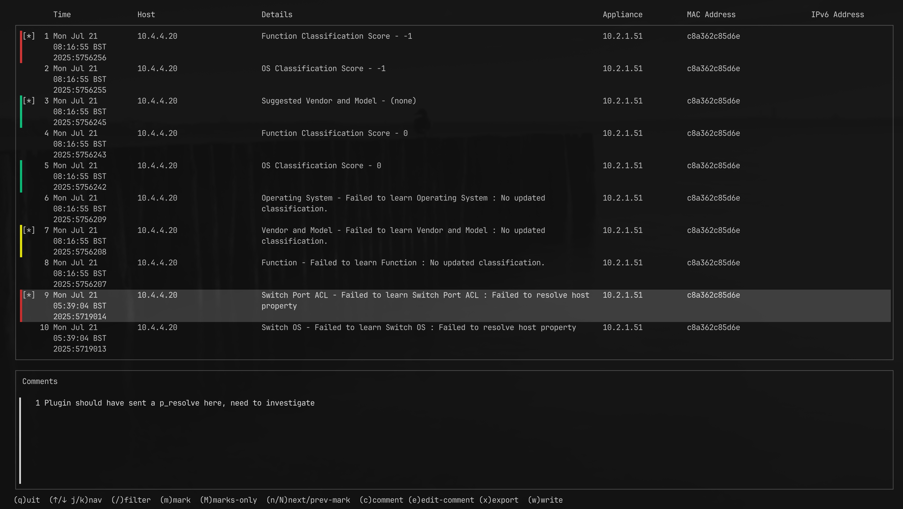

# Siftly Hostlog



**Siftly Hostlog** is a simple alternative to analysing **Eyesights Host Logs**.  
Instead of relying on `grep` pipelines or exporting into Excel, you can review and annotate host logs directly in the terminal.

It provides:
- Simple **RAG marking** against rows (Red/Amber/Green).
- Ability to **add comments** against each line as part of troubleshooting.
- A fast terminal UI that keeps you inside the shell workflow.

---

## Features

- Load host log data from CSV or from a previously saved JSON snapshot.
- Quickly highlight rows of interest with color markers.
- Attach comments to specific rows, useful for investigations and handovers.
- Export your annotated session back to JSON for later reloading.

---

## Installation

Clone the repository and build with Go:

```bash
git clone https://github.com/youruser/siftly-hostlog.git
cd siftly-hostlog
go build -o siftly-hostlog .
```

---

## Usage

```bash
siftly-hostlog [--debug debug.log] <file.csv|file.json>
```

- If you provide a `.csv` file, Siftly will parse and display the data.
- If you provide a `.json` file (previously saved via **write/export**), Siftly will restore the session with marks and comments intact.

Example:

```bash
# Start with a raw CSV export
siftly-hostlog eyesight_hosts.csv

# Reload later with your notes preserved
siftly-hostlog session.json
```

---

## Keybindings

| Key                  | Action                                |
|-----------------------|---------------------------------------|
| `q`                  | Quit                                  |
| `↑ / k`              | Move up                               |
| `↓ / j`              | Move down                             |
| `f`                  | Filter (regex)                        |
| `m`                  | Mark/unmark current row               |
| `M`                  | Jump to next/previous marked row       |
| `c`                  | Add a comment to the current row       |
| `e`                  | Edit existing comment                 |
| `x`                  | Export (CSV/JSON)                     |
| `w`                  | Write/save current session (JSON)     |
| `n / N`              | Next / previous marked row navigation |
| `?`                  | Show help (if implemented)            |

---

## Workflow Example

1. Load your CSV log file.
2. Navigate with `j`/`k` and mark interesting lines (`m`).
3. Add notes with `c` to explain why a row is significant.
4. Use `M` or `n/N` to quickly jump between marked rows.
5. Save your session with `w` for later review.
6. Reopen the `.json` file to continue exactly where you left off.

---


